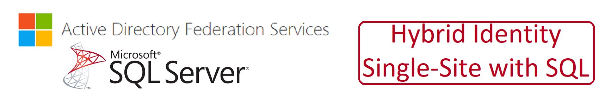

# Hybrid Identity Single-Site (ADFS with SQL)

Click the button below to deploy

This Template IS MEANT TO BE USED AS AN ADD-ON to the following labs which must already be deployed:
**** THE PARAMETERS SPECIFIED FOR THIS ADD-ON LAB MUST MATCH THE PARAMETERS OF THE BASE LAB THAT IT WILL BE ADDED TO ****

- "PKI_2-Tier_CA_with_OCSP" or "PKI_Enterprise_CA_With_OCSP"
- "SQLServer_Domain-Joined"

This Template IS MEANT TO BE USED AS AN OPTIONAL ADD-ON to the following labs:
**** THE PARAMETERS SPECIFIED FOR THIS ADD-ON LAB MUST MATCH THE PARAMETERS OF THE BASE LAB THAT IT WILL BE ADDED TO ****

- Exchange2016-Single-Site-with-External-Access
- Exchange2019-Single-Site-with-External-Access

The Template deploys the folowing:

- 1 - Azure AD Connect Server (AD Connect Downloaded)
- 1 - ADFS Server
- 1 - WAP Server

The deployment leverages Desired State Configuration scripts to further customize the following:

AD Connect
- Download Lastest Version of AD Connect to AD Connect Server

ADFS
- Get ADFS Certificate
- Configure ADFS

WAP
- Import ADFS Certificates
- Configure WAP

Parameters that support changes
- TimeZone.  Select an appropriate Time Zone.
- AutoShutdownEnabled.  Yes = AutoShutdown Enabled, No = AutoShutdown Disabled.
- AutoShutdownTime.  24-Hour Clock Time for Auto-Shutdown (Example: 1900 = 7PM)
- AutoShutdownEmail.  Auto-Shutdown notification Email (Example:  user@domain.com)
- SQLHost.  Name of SQL Host (Example:  KHL-SQL-01)
- Admin Username.  Enter a valid Admin Username
- Admin Password.  Enter a valid Admin Password
- WindowsServerLicenseType.  Choose Windows Seer License Type (Example:  Windows_Server or None)
- AzureADConnectDownloadUrl.  Download location for Azure AD Connect.
- Naming Convention. Enter a name that will be used as a naming prefix for (Servers, VNets, etc) you are using.
- Sub DNS Domain.  OPTIONALLY, enter a valid DNS Sub Domain. (Example:  sub1. or sub1.sub2.    This entry must end with a DOT )
- Sub DNS BaseDN.  OPTIONALLY, enter a valid DNS Sub Base DN. (Example:  DC=sub1, or DC=sub1,DC=sub2,    This entry must end with a COMMA )
- Net Bios Domain.  Enter a valid Net Bios Domain Name (Example:  sub1).
- Internal Domain.  Enter a valid Internal Domain (Exmaple:  killerhomelab)
- InternalTLD.  Select a valid Top-Level Domain for your Internal Domain using the Pull-Down Menu.
- External Domain.  Enter a valid External Domain (Exmaple:  killerhomelab)
- ExternalTLD.  Select a valid Top-Level Domain for your External Domain using the Pull-Down Menu.
- Vnet1ID.  Enter first 2 octets of your desired Address Space for Virtual Network 1 (Example:  10.1)
- Vnet2ID.  Enter first 2 octets of your desired Address Space for Virtual Network 2 (Example:  10.2)
- Reverse Lookup1.  Enter first 2 octets of your desired Address Space in Reverse (Example:  1.10)
- Reverse Lookup2.  Enter first 2 octets of your desired Address Space in Reverse (Example:  2.10)
- Root CA Name.  Enter a Name for your Root Certificate Authority
- Issuing CA Name.  Enter a Name for your Issuing Certificate Authority
- ADCOSVersion.  Select 2022-Datacenter (Windows 2022), 2019-Datacenter (Windows 2019) or 2016-Datacenter (Windows 2016) Azure AD Connect OS Version
- WAPOSVersion.  Select 2022-Datacenter (Windows 2022), 2019-Datacenter (Windows 2019) or 2016-Datacenter (Windows 2016) Web Application Proxy OS Version
- ADFSOSVersion.  Select 2022-Datacenter (Windows 2022), 2019-Datacenter (Windows 2019) or 2016-Datacenter (Windows 2016) Active Directory Federation Services OS Version
- ADCVMSize.  Enter a Valid VM Size based on which Region the VM is deployed.
- ADFS1VMSize.  Enter a Valid VM Size based on which Region the VM is deployed.
- ADFS2VMSize.  Enter a Valid VM Size based on which Region the VM is deployed.
- WAP1VMSize.  Enter a Valid VM Size based on which Region the VM is deployed.
- WAP2VMSize.  Enter a Valid VM Size based on which Region the VM is deployed.